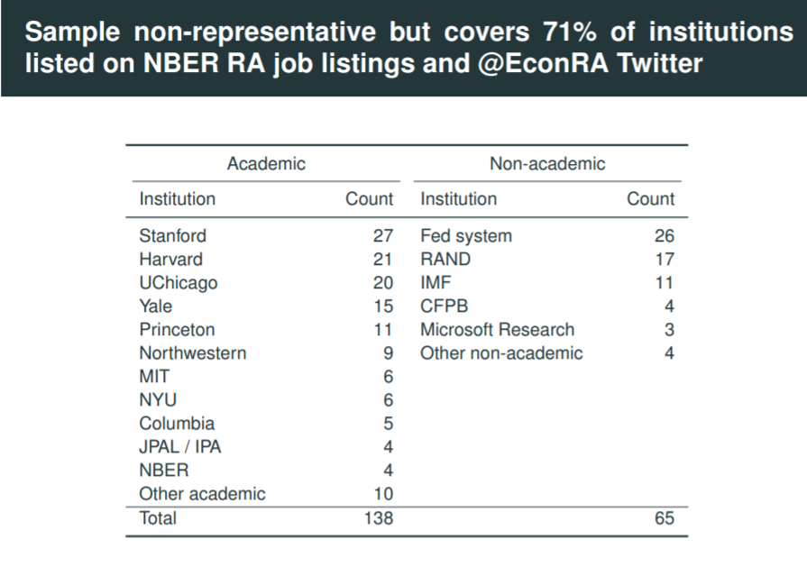
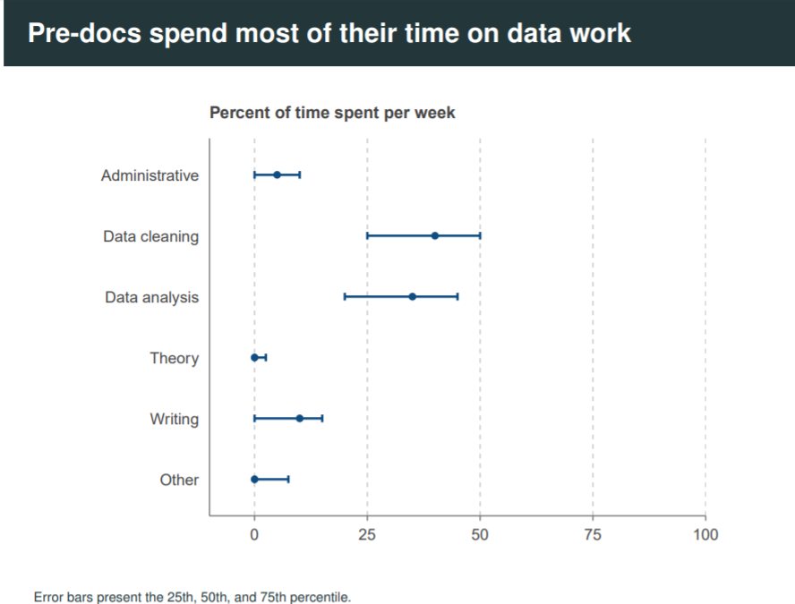
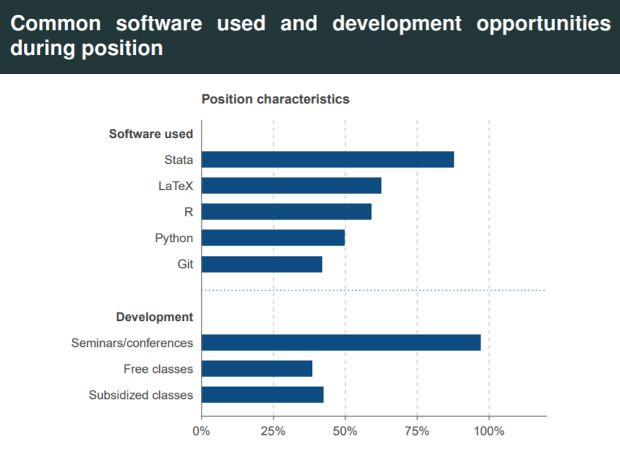
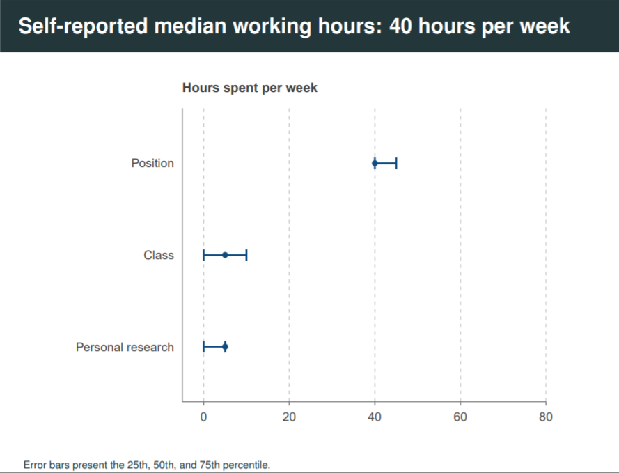
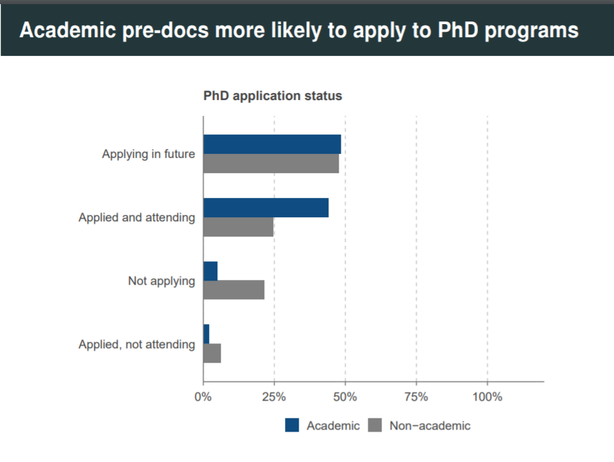
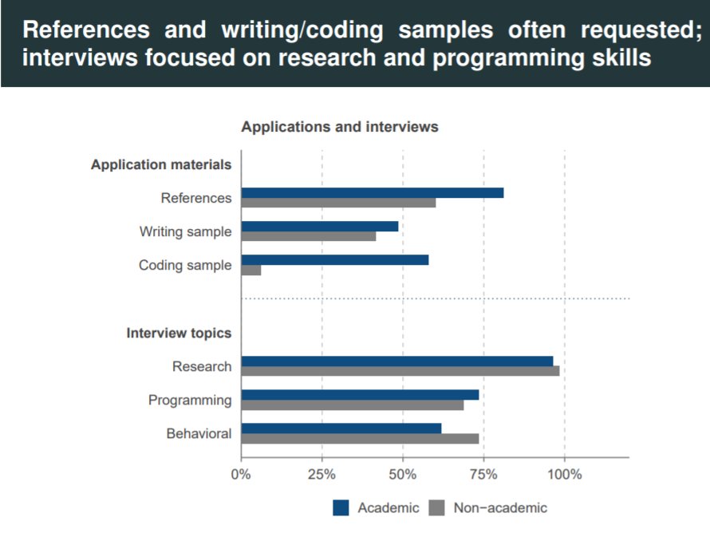

```{r setup, include=FALSE}
options(htmltools.dir.version = FALSE)
library(knitr)
opts_chunk$set(
  fig.align="center", #fig.width=6, fig.height=4.5, 
  # out.width="748px", #out.length="520.75px",
  dpi=300, #fig.path='Figs/',
  cache=T#, echo=F, warning=F, message=F
  )
```

# Table of contents

1. [Mi experiencia postulando al Pre-Doc](#experiencia)

2. [¿Cómo sé si me gusta la academia?](#comose)

3. [¿Cómo Aplicar?](#comoapp)

4. [Fuentes](#fuentes)


---
class: inverse, center, middle
name: experiencia

# Mi experiencia postulando al PreDoctoral Fellowship

<html><div style='float:left'></div><hr color='#EB811B' size=1px width=796px></html>

---

# Mi Background 

- Economista.

- Interés en temas de mobilidad social, desigualdad, y poblaciones vulnerables.

- Experiencia como RA en IPA y CIUP.

- Actualmente en Princeton University como Pre-doctoral fellow.

  - Donde veo temas de mobilidad social, género, y economía política

---
class: inverse, center, middle
name: comose

# ¿Cómo sé si ser RA es una buena opción para mí?
<html><div style='float:left'></div><hr color='#EB811B' size=1px width=796px></html>

---

# Lugares internacionales con programas extensos para RAships

<div align="center">

</div>

---

# Actividades comúnes en estos puestos

<div align="center">

</div>
---

# Softwares comúnmente usados

<div align="center">

</div>
---

# Distribución del tiempo de un RA 

<div align="center">

</div>

---

# Pequeña diferencia entre un Predoctoral fellowship y un RAship

- Son asistentes de investigación graduados del pregrado con énfasis en seguir un PhD. 
- Las herramientas dentro del programa te permiten prepararte para aplicar

<div align="center">

</div>


---
class: inverse, center, middle
name: comoapp

# ¿Cómo Aplicar?
<html><div style='float:left'></div><hr color='#EB811B' size=1px width=796px></html>

---

# Requisitos para postular

<div align="center">

</div>


---

class: inverse, center, middle
name: fuentes

# Fuentes
<html><div style='float:left'></div><hr color='#EB811B' size=1px width=796px></html>

---

# Fuentes:

- Econ RA Guide: https://raguide.github.io 

- Survey of Pre-Doctoral Research Experiences in Economics: https://z-y-huang.github.io/predoc_survey/slides.pdf 

---
class: inverse, center, middle
name: gracias

# Gracias!

Contacto: Paola Villa Paro , pparo@princeton.edu
<html><div style='float:left'></div><hr color='#EB811B' size=1px width=796px></html>
